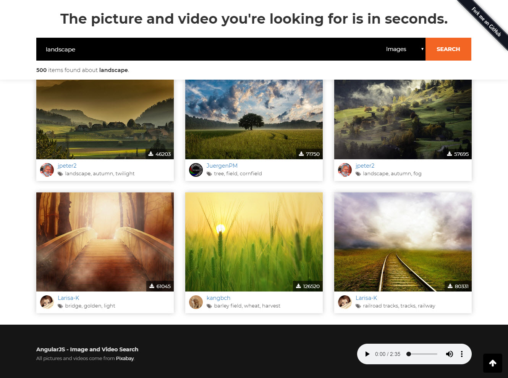

# AngularJS - Image and Video Search
Get millions of photos and videos in seconds with [AngularJS Framework](https://angularjs.org/).

# ReactJS Version
Access the application created with ReactJS **[here](https://github.com/NazimMertBilgi/ReactJS-Image-and-Video-Search)**.

## Demo
You can start the search with  **[this link](https://nazimmertbilgi.github.io/AngularJS-Image-and-Video-Search/)**



## Configurations
You can find all configurations inside the `assets/js/constants.js`

|Key|Description|Value Type|Default|
|--|--|--|--|
|api_url|Base url of Pixabay API|`string`|[https://pixabay.com/api](https://pixabay.com/api)|
|api_key|Key for use Pixabay API|`string`|Please create your own api key from [https://pixabay.com/en/service/about/api/](https://pixabay.com/en/service/about/api/)
|item_count_per_page|Determine the number of results per page|`number/int`|24


## Contribution
Contribution are always **welcome and recommended!** Here is how:
- Fork the repository [(here is the guide).](https://help.github.com/articles/fork-a-repo/)
- Clone to your machine.
```
git clone https://github.com/YOUR_USERNAME/AngularJS-Image-and-Video-Search.git
```
- Install all development packages with `npm install` command on root.
- Make your changes.
- Create a pull request.

## License
**AngularJS - Image and Video Search** is an open source project that is licensed under the [MIT license](http://opensource.org/licenses/MIT).


## Image Credit
[Pixabay](https://pixabay.com) - Discover the best source for free images and videos.
